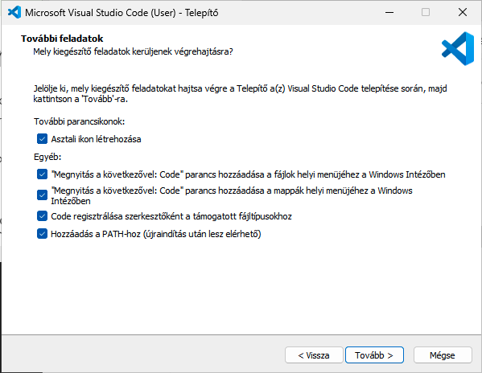

# Go fejleszési alapok

## Go telepítése

1. Töltsd le a megfelelő csomagot: https://go.dev/dl
2. Telepítőt futtasd le
3. Ellenőrizd a telepítést. Windows esetén indíts egy CMD-t

```cmd
go verison
```

## Visual Studio Code telepítése (ha abban szeretnél fejleszteni)

1. Töltsd le a megfelleő csomagot: https://code.visualstudio.com/Download
2. Telepítőt futtasd le. (Windows esetén az alábbi jelölőnégyzeteket válaszd)



3. Ha készen van indítsd el, hogy telepítsünk néhány kiegészítőt
4. Kiegészítők:
    1. Nyomd meg a CTRL + SHIFT + X billentyűket egyszerre
    2. **Nyelv telepítése**: Keress rá a `Hungarian` kifejezésre, mad a találatoknél telepítsd fel (`Install`) a kiegészítőt. Majd CTRL + SHIFT + P, keress rá a `Configure language` kifejezésre és válaszd a `magyar` lehetőséget. A VS Code kéri a program újraindítását. Ezután már magyarul fog a VS Code elindulni.
    3. Go kiegészítők: (CTRL + SHIFT + X) Keress rá a `Go` kifejezésre. Az első `Go` nevű kiegészítőt telepítsd fel
5. Zárd be a Visual Studio Code-ot

## Projekt létrehozás

1. Nyiss egy parancssort (CMD)
2. Navigálj abba a mappába ahol a kódod fogod tárolni a helyi gépeden.
3. Hozd létre a projekted mappáját. Pl.: `elsoprojekt`

```bash
mkdir elsoprojekt
```

4. Lépj be a mappába

```bash
cd elsoprojekt
```

5. Készítsd el a projekted alap struktúráját
```bash
go mod init elsoprojekt
```

6. indítsd el innen a Visual Studio Code-ot.

```bash
code .
```

Megjegyzés: `Do you trust the authors of the files in this folder?` kérdés esetén kattints a `Yes, I trust the authors` gombra

7. Első futáskor telepíteni kell még olyan csomagokat, amelyek szükségesek a zökkenőmentes fejlesztéshez. Erre a Visual Studio Code fel is hívja a figyelmet. Ezt az alábbi parancs futtatásával lehet elvégezni. (nyiss egy terminal-t a VS Code-ban):

```bash
go install -v golang.org/x/tools/gopls@latest
```

Most már készen állunk az utazásra a Go világában!

## Visual Studio Code debug beállítások

1. Hozd létre a `launch.json` fájlt a `.vscode` mappában
2. `main.go` a projekt fő állománya. Ehhez állítjuk be a hibakeresést is

```json
{
  // Use IntelliSense to learn about possible attributes.
  // Hover to view descriptions of existing attributes.
  // For more information, visit: https://go.microsoft.com/fwlink/?linkid=830387
  "version": "0.2.0",
  "configurations": [
    {
      "name": "Launch file",
      "type": "go",
      "trace": "verbose",
      "showLog": true,
      "logOutput": "dap",
      "request": "launch",
      "mode": "debug",
      "program": "${workspaceFolder}/main.go"
    }
  ]
}
```

## Egyéb

1. MacOS esetén kerüld a projektekben az 5000-es és a 7000-es portok használatát, mert ezek használatban vannak az OS által.
2. Szükséges csomagok telepítése: `go get .`
3. Projekt futtatása: `go run .` vagy `go run main.go`
